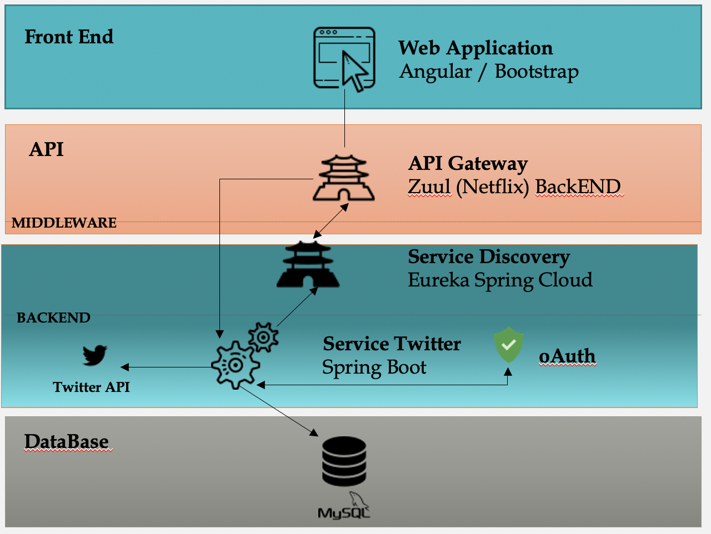
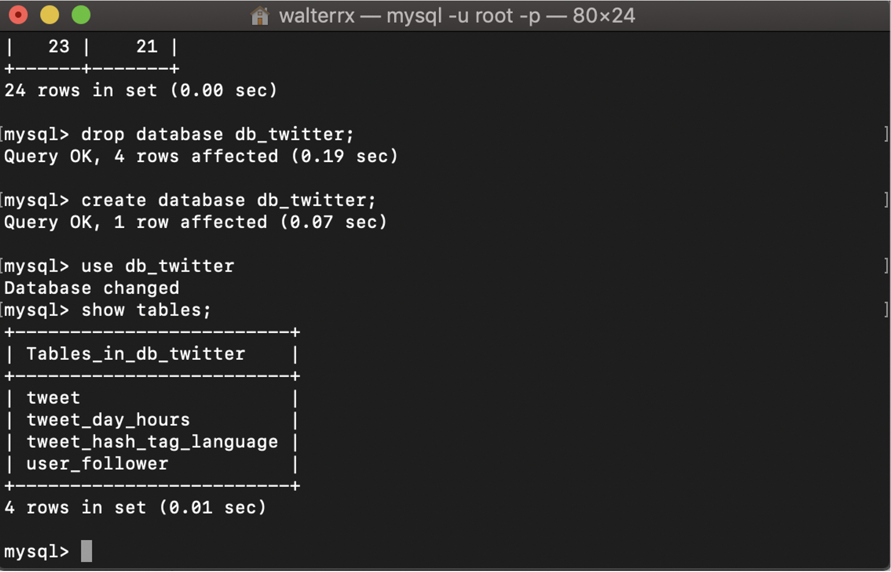
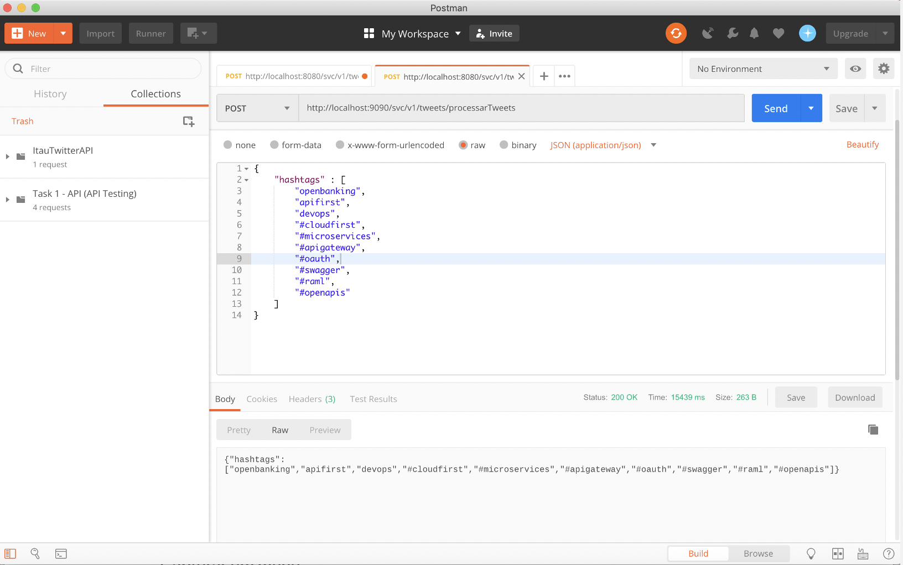
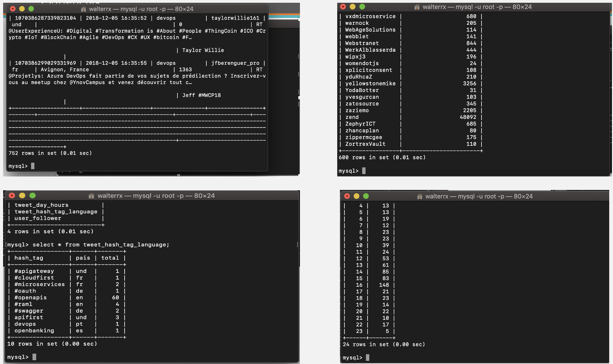

# Case Integração de Sistemas

Estudo de Caso tem o objetivo criar duas APIs REST, sendo, uma para consumir a API do Twitter e outra para trazer as informações processadas conforme regras estabelecidas.

* Out/2018 * 

## Arquitetura de Referência

- Frontend Angular responsável por exibir as informacoes da aplicacao.
- Middleware utilizando o MicroGateway Zuul da Netflix responsavel como portal dos microservicos da empresa
- Backend em Java-Springboot atuando como microservicos da aplicacao
- Banco de dados MySQL via Hibernate/ JPA

obs.: Neste case não foi utilizado os padrões RESTfull ***



## Testando a Aplicacao 

### Executando a aplicacao para criacao do Banco de Dados e Tabelas

Via Springboot, executar a aplicacao para criacao automática do Banco de dados e das tabelas.



### Carregando das informacoes do Twitter dado determinadas Hashtags

Via POSTMAN, inserir a URL localhost:9090/svc/v1/tweets/processarTweets e incluir o payload abaixo para execução da API do Twitter e cadastramento das informacoes dado as hashtags abaixo:


```json
{
    "hashtags":[
        "openbanking",
        "apifirst",
        "devops",
        "cloudfirst",
        "microservices"
    ]
}

```

Resultado esperado:



### Confirmacao da Insercao do processamento no banco de dados

Resultado esperado:

